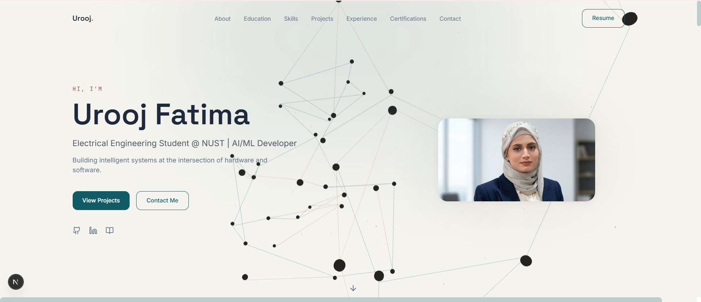
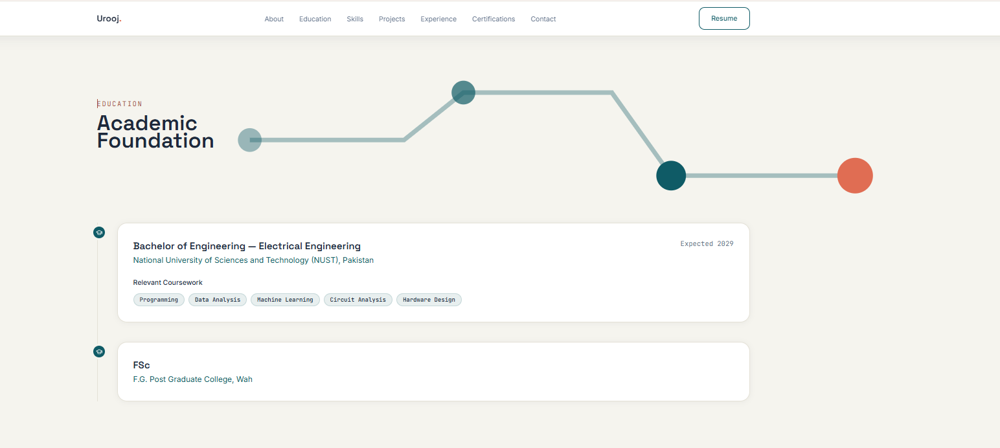
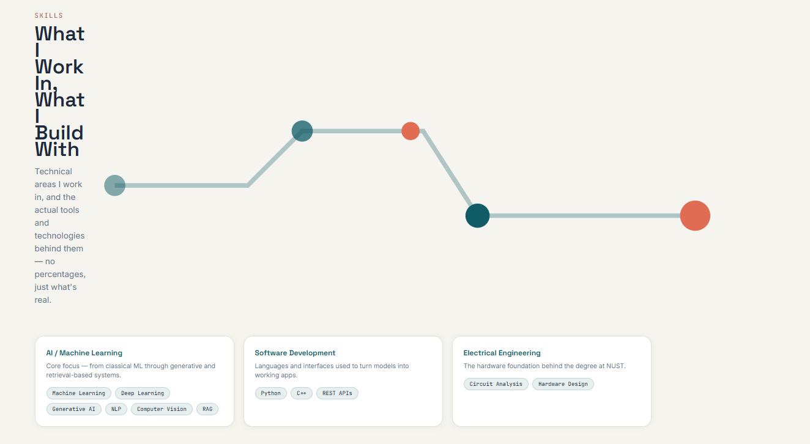
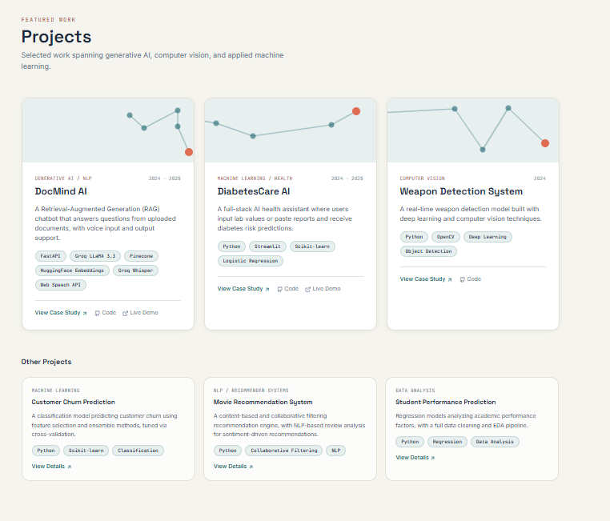

<div align="center">


# Urooj Fatima — AI/ML Portfolio

**Electrical Engineering Student @ NUST | Self-Taught AI/ML Developer**

*Building intelligent systems at the intersection of hardware and software.*

[](https://uroojtechify.netlify.app/)
[](https://github.com/uroojbuilds)
[](https://www.linkedin.com/in/urooj-fatima-b52495342)

</div>


## Table of Contents

- [Preview](#preview)
- [About](#about)
- [Tech Stack](#tech-stack)
- [Featured Projects](#featured-projects)
- [Project Structure](#project-structure)
- [Getting Started](#getting-started)
- [Customization Guide](#customization-guide)
- [Deployment — Netlify](#deployment--netlify)
- [Troubleshooting](#troubleshooting)
- [Roadmap](#roadmap)
- [Contact](#contact)


## Preview

**Live demo:** [uroojtechify.netlify.app](https://uroojtechify.netlify.app/)



<details>
<summary><b>More screens</b></summary>
<br>

<table>
<tr>
<td width="50%">

**Education**


</td>
<td width="50%">

**Skills**


</td>
</tr>
</table>

**Projects**


</details>


## About

I chose Electrical Engineering because my interest in both hardware and software made me curious about the world of robotics and AI. This repository is my personal portfolio — a Next.js site that showcases who I am, what I've built, and how to reach me.

The site itself is fully data-driven (see [Customization Guide](#customization-guide)) and ships with a private, GitHub-OAuth-protected **admin dashboard** for managing projects, experience, education, certifications, and skills without touching code directly.


## Tech Stack

| Category | Technologies |
|---|---|
| **Frontend** | Next.js 15 (App Router), React 19, TypeScript, Tailwind CSS, Framer Motion, Three.js / React Three Fiber |
| **Auth / Admin** | Auth.js (NextAuth v5) with the GitHub OAuth provider, JWT sessions |
| **Database** | Neon (serverless Postgres) via Drizzle ORM, schema migrations in `drizzle/` |
| **Integrations** | GitHub REST API (server-side repository discovery for the admin dashboard) |
| **Icons** | Lucide React |
| **Deployment** | Netlify (`@netlify/plugin-nextjs`) |


## Featured Projects

### [DocMind AI](https://github.com/uroojbuilds/Docmind-Ai) — *Generative AI / NLP*
A Retrieval-Augmented Generation (RAG) chatbot that answers questions from uploaded documents, with voice input and output support.
- Document ingestion, chunking, and embedding pipeline
- LLM-based response generation grounded in the uploaded document
- Voice input/output via Groq Whisper + the Web Speech API
- Agent routing layer that falls back to web search when the document doesn't contain the answer
- **Stack:** FastAPI · Groq LLaMA 3.3 · Pinecone · HuggingFace Embeddings
- Live demo: [docmindaichatbot.netlify.app](https://docmindaichatbot.netlify.app)

### [DiabetesCare AI](https://github.com/uroojbuilds/Diabetes-Care-Ai) — *Machine Learning / Health*
A full-stack AI health assistant where users input lab values or paste reports and receive diabetes risk predictions.
- Bilingual (English/Urdu) interface
- Full preprocessing pipeline: EDA, feature engineering, model evaluation
- **Stack:** Python · Streamlit · Scikit-learn · Logistic Regression
- Live demo: [your-health-assistent-c5bgjggd7xtabmvozv3qxt.streamlit.app](https://your-health-assistent-c5bgjggd7xtabmvozv3qxt.streamlit.app)

### [Weapon Detection System](https://github.com/uroojbuilds/Computer-Vision) — *Computer Vision*
A real-time weapon detection model built with deep learning and computer vision techniques.
- Real-time detection pipeline
- Image preprocessing and augmentation
- Model fine-tuning and evaluation on a custom dataset
- **Stack:** Python · OpenCV · Deep Learning

<details>
<summary><b>Other projects</b></summary>
<br>

| Project | Category | Stack |
|---|---|---|
| Customer Churn Prediction | Machine Learning | Python, Scikit-learn, Classification |
| Movie Recommendation System | NLP / Recommender Systems | Python, Collaborative Filtering, NLP |
| Student Performance Prediction | Data Analysis | Python, Regression, EDA |

</details>


## Project Structure

```
app/
  admin/               Protected admin dashboard (GitHub OAuth sign-in required)
    sign-in/           Admin sign-in page
    (protected)/       CRUD pages for projects, experience, education,
                       certifications, and skills
  api/                 Route handlers (incl. Auth.js callback routes)
  page.tsx             Public portfolio homepage
components/
  sections/            One component per portfolio section (Hero, About, Projects, etc.)
  ui/                  Reusable primitives (Button, Badge, SectionHeading, CircuitField)
  project-card/        ProjectCard + ProjectModal (case-study detail view)
  admin/               Shared admin form components (FormField, SubmitButton, DeleteButton)
data/                  Public-site content as typed data — edit these files, not components
lib/
  actions/             Server Actions for admin CRUD (projects, experience, education,
                       certifications, skills) and GitHub repository import
  auth/                Admin-access re-verification helpers
  db/                  Drizzle client, schema, and seed script
  github/              Server-side GitHub API client
  config.ts            Site URL / metadata constants
  utils.ts             Shared utilities
drizzle/                SQL migrations generated from lib/db/schema.ts
public/
  images/profile.jpg   Headshot
  resume.pdf           Downloadable CV
auth.ts                 Auth.js configuration (GitHub OAuth, admin allow-list, JWT sessions)
netlify.toml             Netlify build configuration
drizzle.config.ts        Drizzle Kit configuration
.env.example             Reference for all required environment variables
```


## Getting Started

```bash
git clone https://github.com/uroojbuilds/urooj-portfolio.git
cd urooj-portfolio
npm install
npm run dev
```

Open [http://localhost:3000](http://localhost:3000) to view the public site locally — this works without any environment variables.

**To use the admin dashboard locally**, copy `.env.example` to `.env.local` and fill in real values, then run the database setup:

```bash
npm run db:generate   # generate SQL migrations from lib/db/schema.ts
npm run db:migrate     # apply migrations to your database
npm run db:seed        # (optional) seed initial data
```

See [Deployment](#deployment--netlify) below for what each variable in `.env.example` is for.


## Customization Guide

To update the **public site's** content, edit the corresponding file in `data/` — no component code needs to change:

| File | Controls |
|---|---|
| `data/profile.ts` | Name, headline, bio, email, social links, resume path |
| `data/education.ts` | Degree info, coursework, GPA |
| `data/skills.ts` | Skill categories and soft skills |
| `data/projects.ts` | Add/edit project entries — `featured: true` for full case-study cards |
| `data/experience.ts` | Internships, roles, status |
| `data/certifications.ts` | Certificates by category |

Alternatively, once the admin dashboard is configured (see [Deployment](#deployment--netlify)), projects, experience, education, certifications, and skills can be managed from `/admin` instead of editing these files directly.

- **Photo:** swap `public/images/profile.jpg` (or update the path in `components/sections/Hero.tsx`)
- **Resume:** swap `public/resume.pdf`
- **Contact form:** `components/sections/Contact.tsx` currently uses a placeholder Formspree endpoint (`https://formspree.io/f/YOUR_FORM_ID`). Create a free form at [formspree.io](https://formspree.io) and replace that value with your own endpoint before going to production.


## Deployment — Netlify

1. Push this repository to GitHub.
2. In Netlify: **Add new site → Import an existing project** → connect this GitHub repository.
3. Netlify detects Next.js automatically via `netlify.toml` (`@netlify/plugin-nextjs`) — build command (`npm run build`) and publish directory (`.next`) are already configured.
4. Click **Deploy**. The public portfolio pages will work immediately with no environment variables.
5. **To enable the admin dashboard**, add the following under **Site settings → Environment variables** (see `.env.example` for full descriptions — never commit real values):

   | Variable | Purpose |
   |---|---|
   | `DATABASE_URL` | Neon Postgres connection string (read by Drizzle) |
   | `AUTH_SECRET` | Auth.js session encryption secret (`npx auth secret`) |
   | `AUTH_GITHUB_ID` / `AUTH_GITHUB_SECRET` | GitHub OAuth App credentials for admin sign-in |
   | `ADMIN_EMAIL` | The exact GitHub account email allowed to sign in as admin — every other account is rejected |
   | `GITHUB_TOKEN` | *(optional)* Token for the admin's GitHub repository-import feature; works unauthenticated at a lower rate limit if unset |
   | `GITHUB_OWNER` | *(optional)* GitHub username for repository discovery — falls back to `profile.social.github` in `data/profile.ts` if unset |

6. *(Optional)* Add a custom domain under **Site settings → Domain management**.


## Troubleshooting

| Issue | Fix |
|---|---|
| Fonts fail to load during build | Google Fonts requires network access at build time — this works on Netlify's build servers but can fail in network-restricted local sandboxes |
| Contact form doesn't send | Replace the placeholder `FORMSPREE_ENDPOINT` in `components/sections/Contact.tsx` with your own Formspree form URL |
| Images not showing | Confirm the file exists in `public/images/` and the path matches exactly (case-sensitive) |
| "DATABASE_URL is not set" error | Add `DATABASE_URL` to your environment (see `.env.example`) before using any admin/database feature |
| Admin sign-in fails / access denied | `ADMIN_EMAIL` must exactly match the email on the GitHub account you're signing in with — sign-in fails closed for every other account, even a valid OAuth login |
| GitHub repository import returns few/no results | Add `GITHUB_TOKEN` — unauthenticated GitHub API requests are rate-limited much lower |


## Roadmap

- [ ] Achievements section
- [ ] Startup Journey section
- [ ] Blog section
- [ ] Testimonials
- [ ] YouTube section (pending content on [@techwithuroojofficial](https://youtube.com/@techwithuroojofficial))


## Contact

- **Email:** [Uroojbhatti35@gmail.com](mailto:Uroojbhatti35@gmail.com)
- **LinkedIn:** [linkedin.com/in/urooj-fatima-b52495342](https://www.linkedin.com/in/urooj-fatima-b52495342)
- **GitHub:** [github.com/uroojbuilds](https://github.com/uroojbuilds)
- **Medium:** [medium.com/@uroojbhatti35](https://medium.com/@uroojbhatti35)
- **Dev.to:** [dev.to/codewithurooj](https://dev.to/codewithurooj)


<div align="center">

**⭐ If you like this portfolio, consider starring the repo!**

</div>
